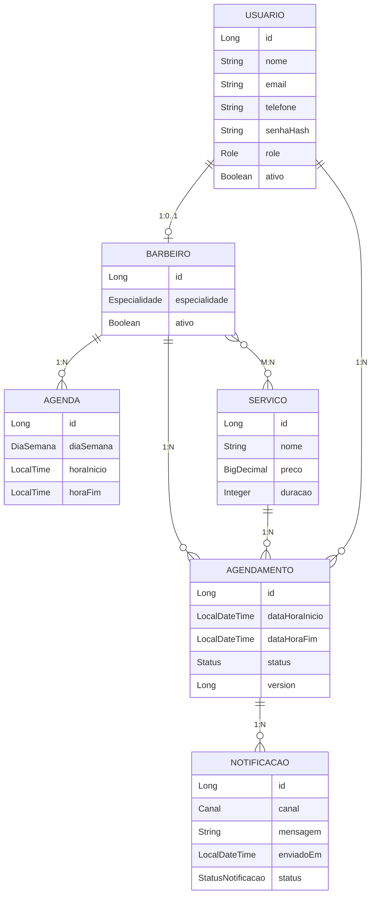

# Barbershop API

Backend for a barbershop scheduling system, currently under active development. The project models the core domain of a barbershop (users, barbers, services, weekly schedules, appointments, and notifications) and currently provides the domain entities, repositories, service layer, and persistence configuration. REST endpoints, authentication, and automated tests are not yet implemented.

## Overview

The system is intended to support the day-to-day operation of a barbershop, including:

- registering and managing users (clients, barbers, and administrators);
- cataloging the services offered (with price and duration);
- managing each barber's weekly availability;
- booking, listing, and validating appointments (with conflict detection);
- recording notifications related to appointments for future delivery through multiple channels.

At this stage the backend is responsible only for the domain model, persistence, and business rules in the service layer. No HTTP API is exposed beyond a trivial health endpoint.

The project is part of a software engineering student's portfolio and is used as a learning environment for backend development practices.

## Current Features

The following functionality is currently implemented in the source code:

- Domain model (JPA entities) for `Usuario`, `Barbeiro`, `Servico`, `Agenda`, `Agendamento`, and `Notificacao`.
- Enumerations for `Role`, `Especialidade`, `DiaSemana`, `Status`, `Canal`, and `StatusNotificacao`.
- Spring Data JPA repositories with derived queries and JPQL queries (including a conflict-detection query for appointments and a "barbers offering a service" query).
- Service layer with `@Transactional` read/write separation, encapsulating business rules such as:
    - user creation with password hashing (`BCryptPasswordEncoder`);
    - duplicate-email and duplicate-service-name validation;
    - barber activation/deactivation;
    - weekly schedule (`Agenda`) creation per barber per day;
    - appointment creation with service-duration calculation, barber availability, and time-conflict validation;
    - optimistic locking via `@Version` on `Agendamento` to handle concurrent bookings.
- Bean Validation annotations (`@NotBlank`, `@Email`, `@Pattern`, `@NotNull`, `@DecimalMin`, `@Min`) on entities.
- A minimal `TestController` exposing `GET /` that returns a placeholder string.
- Spring Security configuration scaffolding with CSRF disabled and all requests currently permitted, plus a `PasswordEncoder` bean. Authentication is not yet implemented.

## Domain Model

The following entities are currently implemented.

- **Usuario** — represents a system user. Stores name, email (unique), phone (digits only, normalized on persist/update), password hash, role (`CLIENTE`, `BARBEIRO`, `ADMIN`), activation flag, and audit timestamps.
- **Barbeiro** — represents a barber. Has a one-to-one relationship with `Usuario`, an `Especialidade` (`CORTE`, `BARBA`, `SOMBRACELHA`), an activation flag, a many-to-many relationship with `Servico`, and a one-to-many relationship with `Agenda`.
- **Servico** — represents a service offered by the barbershop (name, price, duration in minutes). Name is unique.
- **Agenda** — represents a barber's weekly availability for a specific `DiaSemana`, with a start and end time. Validation ensures the start time precedes the end time.
- **Agendamento** — represents a booking. Links a `Usuario`, a `Barbeiro`, and a `Servico` for a specific start/end window, with a `Status` (`AGENDADO`, `CONFIRMADO`, `CANCELADO`, `CONCLUIDO`, `REAGENDADO`) and optimistic locking via `@Version`.
- **Notificacao** — represents a notification linked to an `Agendamento`, sent through a `Canal` (`WHATSAPP`, `SMS`, `EMAIL`), with a `StatusNotificacao` (`PENDENTE`, `ENVIADO`, `FALHOU`).



## Architecture

The project follows a standard layered Spring Boot architecture. The layers currently implemented are:

```text
Controller (TestController only)
    |
    v
Service (Usuario, Barbeiro, Servico, Agenda, Agendamento)
    |
    v
Repository (Spring Data JPA)
    |
    v
Database (PostgreSQL via JPA/Hibernate)
```

- `controller` contains a single placeholder controller (`TestController`). No REST endpoints for the domain resources are implemented yet.
- `service` contains the business logic for users, barbers, services, schedules, and appointments. Each service is read-only at the class level and overrides individual write operations with `@Transactional`.
- `repository` contains Spring Data JPA interfaces for each entity.
- `entity` contains JPA entities and enumerations.
- `config` contains Spring Security configuration.

Cross-cutting support is configured in `application.properties` (datasource and JPA) and `BarbershopApplication.java` (Spring Boot main class).

## Technologies

Confirmed from `pom.xml` and imports:

- Java 25
- Spring Boot 4.0.5 (`spring-boot-starter-parent`)
- Spring Data JPA (`spring-boot-starter-data-jpa`)
- Spring Security (`spring-boot-starter-security`)
- Bean Validation (`spring-boot-starter-validation`)
- Spring Web MVC (`spring-boot-starter-webmvc`)
- Spring Boot DevTools (runtime, optional)
- PostgreSQL JDBC driver (`org.postgresql`, runtime)
- Hibernate (transitively via Spring Data JPA)
- Lombok (compile-time annotation processor)
- JUnit 5 / Spring Boot Test (`spring-boot-starter-test`, test scope)
- Spring Security Test (`spring-security-test`, test scope)
- Maven (build tool)

## Project Structure

```text
src/main/java/com/marcelo/barbershop
├── BarbershopApplication.java        Spring Boot entry point
├── config
│   └── SecurityConfig.java           Spring Security configuration (scaffolding)
├── controller
│   └── TestController.java           Placeholder endpoint
├── entity                            JPA entities and enumerations
│   ├── Usuario.java
│   ├── Barbeiro.java
│   ├── Servico.java
│   ├── Agenda.java
│   ├── Agendamento.java
│   ├── Notificacao.java
│   ├── Role.java
│   ├── Especialidade.java
│   ├── DiaSemana.java
│   ├── Status.java
│   ├── Canal.java
│   └── StatusNotificacao.java
├── repository                        Spring Data JPA repositories
│   ├── UsuarioRepository.java
│   ├── BarbeiroRepository.java
│   ├── ServicoRepository.java
│   ├── AgendaRepository.java
│   ├── AgendamentoRepository.java
│   └── NotificacaoRepository.java
└── service                           Business logic (transactional)
    ├── UsuarioService.java
    ├── BarbeiroService.java
    ├── ServicoService.java
    ├── AgendaService.java
    └── AgendamentoService.java

src/main/resources
└── application.properties            Datasource and JPA configuration

src/test/java/com/marcelo/barbershop
└── BarbershopApplicationTests.java   Spring Boot context-loads test
```

Responsibilities per package:

- `config` — Spring Security configuration and shared beans (`PasswordEncoder`, `UserDetailsService`).
- `controller` — HTTP layer. Currently a placeholder only.
- `entity` — JPA entities, enum types, and domain helpers (lifecycle callbacks, simple invariants).
- `repository` — Spring Data JPA interfaces and derived/JPQL queries.
- `service` — Business rules, transactions, validation, and orchestration between repositories.

## Database

- Database: PostgreSQL (driver declared in `pom.xml`).
- Connection URL: `jdbc:postgresql://localhost:5432/barbershop` (configured in `application.properties`).
- Persistence: Spring Data JPA with Hibernate.
- Schema management: `spring.jpa.hibernate.ddl-auto=validate` — the schema is expected to exist already; Hibernate only validates it at startup.
- SQL logging is enabled (`spring.jpa.show-sql=true`, `spring.jpa.properties.hibernate.format_sql=true`).
- No database migrations (Flyway/Liquibase) are configured.
- No seed or sample data is provided.

Entity relationships implemented at the database level:

- `usuarios`, `barbeiros`, `servicos`, `agenda`, `agendamentos`, `notificacao` tables.
- `barbeiros.usuario_id` joins to `usuarios.id` (one-to-one).
- `agendamentos.usuario_id`, `agendamentos.barbeiro_id`, `agendamentos.servico_id` are foreign keys.
- `barbeiro_servico` is the join table for the many-to-many relationship between `barbeiros` and `servicos`.
- Indexes are declared on the frequently queried foreign keys and on `agendamentos.dataHoraInicio`.

Validation rules enforced at the entity level include unique email (`Usuario`), unique service name (`Servico`), non-null and positive price/duration for services, digit-only phone with 10–11 digits, and time-interval invariants in `Agenda` and `Agendamento`.

## Getting Started

### Prerequisites

- Java 25
- Maven (the project includes `mvnw` / `mvnw.cmd` wrappers)
- A running PostgreSQL instance with a database named `barbershop`

### Database Setup

Create a database named `barbershop` and ensure PostgreSQL is reachable on `localhost:5432`.

The schema must be created externally because `ddl-auto` is set to `validate`. The entity definitions in `src/main/java/com/marcelo/barbershop/entity` are the authoritative reference for the expected schema.

### Configuration

`application.properties` currently contains:

```properties
spring.application.name=barbershop

spring.datasource.url=jdbc:postgresql://localhost:5432/barbershop
spring.datasource.username=postgres
spring.datasource.password=123456

spring.jpa.hibernate.ddl-auto=validate
spring.jpa.show-sql=true
spring.jpa.properties.hibernate.format_sql=true
```

The default datasource password is committed to the repository. Before deploying or sharing the project, replace it with an environment variable such as `${DB_PASSWORD}` and provide the value externally. Do not commit real credentials.

### Running the Application

Using the Maven wrapper:

```bash
./mvnw spring-boot:run
```

or on Windows:

```bash
mvnw.cmd spring-boot:run
```

Once running, the only available HTTP endpoint is:

```text
GET /  ->  API rodando!
```

## Tests

The project currently contains a single Spring Boot context-loads test (`BarbershopApplicationTests`) generated by the Spring Initializr. It verifies that the application context starts up successfully.

Run tests with:

```bash
./mvnw test
```

No unit tests, integration tests, or service-layer tests are present yet. Test coverage of the domain and service layer is planned.

## Current Status

The project is under active development. The following parts are functional:

- Domain model and JPA mappings.
- Repositories with derived and JPQL queries.
- Service layer for users, barbers, services, weekly schedules, and appointments, including conflict detection and optimistic locking.
- Spring Security scaffolding and a `PasswordEncoder` bean.

The following areas are still incomplete:

- REST endpoints for any domain resource.
- Authentication and authorization (the security configuration currently permits all requests).
- API documentation (e.g. OpenAPI/Swagger).
- Database migrations.
- Notification dispatch (the `Notificacao` entity exists, but no service or scheduled job delivers notifications).
- Automated tests beyond the default context-loads test.
- Containerization, CI, and observability tooling.

## Roadmap

Planned next steps, derived from the existing code and obvious engineering follow-ups:

- [ ] REST controllers and DTOs for `Usuario`, `Barbeiro`, `Servico`, `Agenda`, `Agendamento`, and `Notificacao`
- [ ] Request validation and standardized error responses (global exception handler)
- [ ] Authentication and authorization (login, JWT or session-based, role-based access control)
- [ ] Replace committed credentials in `application.properties` with environment variables / external configuration
- [ ] Database migrations (Flyway or Liquibase)
- [ ] Automated tests for entities, repositories, and services (unit and integration tests)
- [ ] API documentation (OpenAPI/Swagger)
- [ ] Notification delivery service for `Notificacao` (channel dispatch and retry)
- [ ] Docker support (`Dockerfile`, `docker-compose.yml`)
- [ ] CI pipeline

## Engineering Goals

This project is also a learning environment for backend engineering practices. The focus areas guiding its development are:

- clean layering (controller, service, repository) and separation of concerns;
- consistent use of JPA lifecycle callbacks and Bean Validation;
- transaction management (`@Transactional(readOnly = true)` at class level, write methods explicitly marked);
- detection of concurrent modifications through optimistic locking;
- maintainable, well-documented entity code with explicit business rules;
- progressive introduction of automated tests, API documentation, migrations, and containerization as the project matures.

The project is not yet production-ready. Scalability, security, performance, and operational concerns are intentionally deferred until the core domain and API surface stabilize.

## License

No license file is currently present in the repository.
