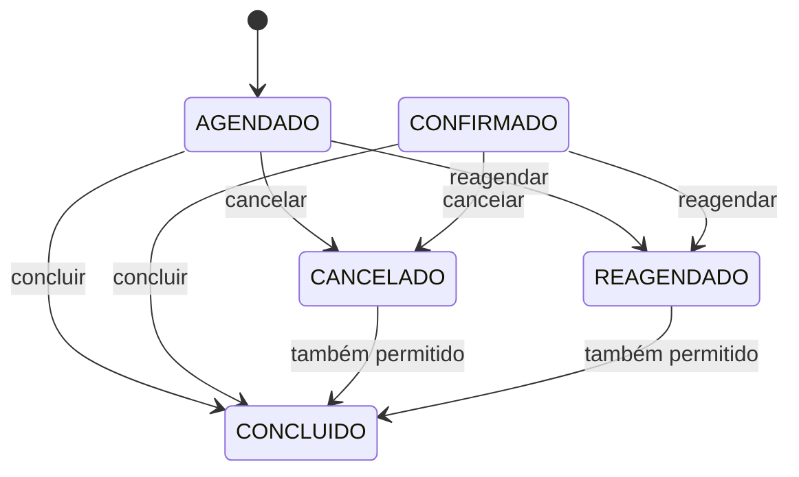

# Regras de negócio e transições

[← Modelo](domain-model.md) · [Fluxos](../diagrams/request-flows.md)

## Implementadas

### Usuários

- E-mail duplicado é rejeitado no service e declarado único na coluna.
- Senha pura recebe BCrypt antes do save.
- Atualização altera somente nome e telefone; ativação é lógica.
- Nome, e-mail e telefone têm constraints; telefone declara 10–11 dígitos.

A normalização ocorre em callback JPA, possivelmente depois da validação automática. Entradas formatadas podem falhar na constraint antes de serem normalizadas.

### Barbeiros, serviços e agenda

- O service impede segundo barbeiro para o mesmo usuário.
- O barbeiro precisa estar ativo, ter serviços e atender o serviço pedido.
- Serviço exige nome, preço `>= 0.01` e duração `>= 1`; duplicidade é verificada apenas na criação.
- Agenda exige início anterior ao fim; criação consulta duplicidade por barbeiro/dia.
- Atualização de agenda não repete a duplicidade e não há constraint única declarada.
- Não há múltiplos turnos, exceções por data, feriados ou bloqueios.

### Agendamentos

- O fim é calculado pela duração corrente do serviço.
- Conflito usa intervalos semiabertos e considera somente `AGENDADO`/`CONFIRMADO`.
- Reagendar/cancelar exige status `AGENDADO` ou `CONFIRMADO`.
- Concluir não valida o status anterior.
- Não se valida passado, usuário ativo/cliente, agenda semanal ou término dentro da disponibilidade.

Nenhum método produz `CONFIRMADO`. `REAGENDADO` não é ativo, não bloqueia novos conflitos e não pode ser cancelado/reagendado novamente: inconsistência concreta da máquina de estados.

### Notificações

- Nascem pendentes; envio define status/timestamp; falha muda status.
- Marcar falha não limpa um eventual `enviadoEm`.
- Não há envio, retry, paginação ou política de conteúdo implementados.
