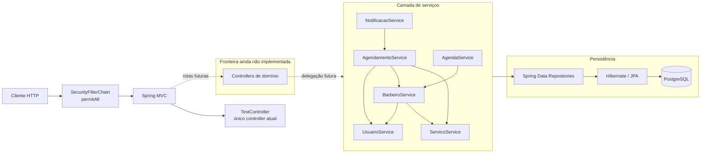
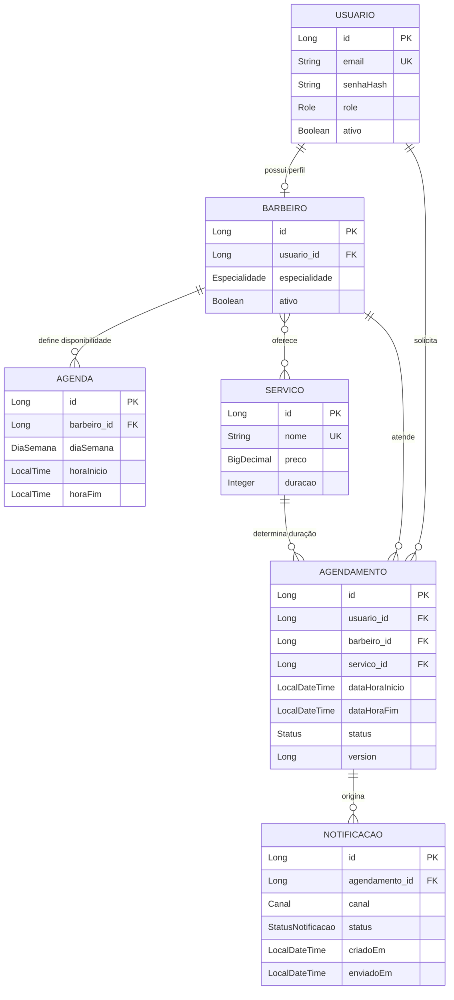

# Guia do projeto `barbershop-api`

## 1. Visão geral

O projeto é o backend, ainda em construção, de um sistema de barbearia. O modelo implementado representa:

- usuários com papéis de cliente, barbeiro ou administrador;
- barbeiros vinculados a usuários e habilitados para determinados serviços;
- serviços com preço e duração;
- agendas semanais de disponibilidade dos barbeiros;
- agendamentos que unem cliente, barbeiro, serviço e intervalo de horário;
- notificações ligadas a agendamentos.

O objetivo percebido no código é concentrar as regras do domínio — disponibilidade, conflito de horários, duração do atendimento, estados do agendamento e envio de notificações — em uma API Spring Boot persistida em PostgreSQL.

É importante separar **o domínio disponível internamente** da **API HTTP disponível atualmente**. As entidades, repositórios e serviços já oferecem várias operações, mas a camada web contém somente um endpoint de verificação (`GET /`). Não existem controllers HTTP para usuários, barbeiros, serviços, agendas, agendamentos ou notificações. Portanto, esses casos de uso existem como métodos Java, mas ainda não estão expostos como API REST.

Arquivos que sustentam essa leitura:

- entrada da aplicação: `src/main/java/com/marcelo/barbershop/BarbershopApplication.java`;
- único controller: `src/main/java/com/marcelo/barbershop/controller/TestController.java`;
- domínio: `src/main/java/com/marcelo/barbershop/entity/`;
- casos de uso: `src/main/java/com/marcelo/barbershop/service/`.

## 2. Tecnologias utilizadas

| Tecnologia | Evidência | Por que participa do projeto |
|---|---|---|
| Java 25 | propriedade `java.version` em `pom.xml` | Linguagem e runtime da aplicação. |
| Spring Boot 4.0.8 | parent de `pom.xml` | Faz a inicialização, autoconfiguração e descoberta dos componentes. |
| Spring Web MVC | `spring-boot-starter-webmvc` | Disponibiliza controllers e endpoints HTTP; hoje é usado apenas por `TestController`. |
| Spring Data JPA | `spring-boot-starter-data-jpa` | Implementa os repositórios a partir de interfaces e traduz as operações para JPA/Hibernate. |
| Hibernate/Jakarta Persistence | anotações em `entity/` e `@Transactional` | Mapeia objetos para tabelas, relacionamentos, callbacks e controle otimista de versão. |
| PostgreSQL | driver em `pom.xml` e URL em `application.properties` | Banco relacional persistente da aplicação. |
| Bean Validation | `spring-boot-starter-validation` e anotações em `Usuario`/`Servico` | Declara restrições de formato e obrigatoriedade no modelo. |
| Spring Security | `spring-boot-starter-security` e `SecurityConfig` | Fornece `PasswordEncoder` e a cadeia de segurança; a autorização HTTP está aberta no estado atual. |
| BCrypt | `BCryptPasswordEncoder` em `SecurityConfig` | Impede que a senha pura seja armazenada por `UsuarioService`. |
| Lombok | dependência e anotações nas entidades | Gera construtor vazio, getters, setters e igualdade baseada explicitamente no ID. |
| Maven + Maven Wrapper | `pom.xml`, `mvnw`, `mvnw.cmd`, `.mvn/wrapper/` | Gerencia build, plugins e dependências. |
| JUnit/Spring Boot Test | dependências de teste e `BarbershopApplicationTests` | Atualmente verifica apenas se o contexto Spring consegue subir. |
| Spring Boot DevTools | dependência runtime opcional | Apoia o ciclo local de desenvolvimento. |

A conexão local é definida em `src/main/resources/application.properties`. O Hibernate está com `ddl-auto=validate`: ele espera que o schema já exista e apenas confere sua compatibilidade; não cria nem atualiza as tabelas. `show-sql=true` e `format_sql=true` tornam o SQL visível e legível durante a execução.

## 3. Arquitetura encontrada

O código segue uma arquitetura em camadas tradicional:

1. **Configuração/entrada:** inicializa o Spring e registra segurança e beans compartilhados.
2. **Controller:** recebe HTTP e delegaria os casos de uso. Hoje só responde ao teste de disponibilidade.
3. **Service:** coordena regras e transações. Serviços podem depender de outros serviços para obter agregados relacionados.
4. **Repository:** fornece CRUD e consultas específicas via Spring Data JPA.
5. **Entity/domain:** representa o modelo persistido e mantém regras que pertencem naturalmente ao próprio objeto.
6. **PostgreSQL:** armazena o estado; o Hibernate faz o mapeamento objeto-relacional.

A divisão tem um motivo útil: os serviços não precisam conhecer SQL, os repositórios não precisam decidir regras de negócio e as entidades preservam invariantes locais mesmo quando são usadas por mais de um serviço. Por exemplo, `AgendamentoService` decide **se** um agendamento pode ser criado, enquanto `Agendamento.definirHorario` decide **como** derivar o fim a partir da duração do serviço.

As dependências caminham, em geral, para dentro:

```text
Controller -> Service -> Repository -> JPA/Hibernate -> PostgreSQL
                  |            |
                  +---------> Entity
```

No estado atual, a primeira seta só existe para o endpoint de teste, que não chama serviços. Os fluxos de negócio começam diretamente na camada `service` até que controllers correspondentes sejam adicionados.

### Transações

Todas as classes de serviço usam `@Transactional(readOnly = true)` no nível da classe. Isso estabelece leitura como padrão e exige que métodos mutáveis declarem `@Transactional` explicitamente. A decisão reduz o risco de uma operação aparentemente de consulta alterar dados por acidente e torna visível onde estão os limites de escrita.

## 4. Estrutura de packages e pastas

```text
barbershop/
├── pom.xml
├── src/
│   ├── main/
│   │   ├── java/com/marcelo/barbershop/
│   │   │   ├── BarbershopApplication.java
│   │   │   ├── config/
│   │   │   ├── controller/
│   │   │   ├── entity/
│   │   │   ├── repository/
│   │   │   └── service/
│   │   └── resources/application.properties
│   └── test/java/com/marcelo/barbershop/
└── docs/PROJECT_GUIDE.md
```

- `com.marcelo.barbershop`: package raiz. Sua posição permite que `@SpringBootApplication` descubra por component scan os subpackages.
- `config`: configuração transversal. Hoje contém segurança HTTP, serviço de usuários para o Spring Security e encoder de senhas.
- `controller`: fronteira HTTP. Contém apenas o endpoint de sanidade.
- `entity`: modelo JPA, enums e regras locais de domínio.
- `repository`: portas de persistência baseadas em `JpaRepository`; combinam consultas derivadas pelo nome e JPQL explícita.
- `service`: casos de uso, coordenação entre entidades/repositórios e limites transacionais.
- `resources`: configuração da aplicação e do datasource.
- `test`: teste de carregamento do contexto, sem testes unitários ou de fluxo específicos.

Não existem no código atual packages de DTO, mapper, exception/handler, migration ou integração externa.

## 5. Principais classes

### Inicialização e configuração

#### `BarbershopApplication`

**Caminho:** `src/main/java/com/marcelo/barbershop/BarbershopApplication.java`

É o ponto de entrada. `@SpringBootApplication` combina configuração, autoconfiguração e component scan. Existe para montar o container Spring e registrar controllers, services e repositories abaixo do package raiz. Seu único método relevante é `main`, que delega a inicialização a `SpringApplication.run`.

#### `SecurityConfig`

**Caminho:** `src/main/java/com/marcelo/barbershop/config/SecurityConfig.java`

Centraliza decisões de segurança e fornece dependências relacionadas a autenticação:

- `securityFilterChain`: desabilita CSRF, form login e HTTP Basic, e libera toda requisição com `permitAll`. Assim, o starter de segurança não bloqueia o endpoint atual, mas também não protege nenhuma rota futura enquanto essa configuração permanecer assim.
- `userDetailsService`: sempre lança `UsernameNotFoundException`. Ele satisfaz a infraestrutura do Spring Security, mas não autentica os usuários persistidos por `UsuarioRepository`.
- `passwordEncoder`: cria `BCryptPasswordEncoder`, consumido por `UsuarioService` para armazenar somente o hash.

O motivo de existir mesmo sem autenticação operacional é separar a política HTTP do hashing de senhas. Entretanto, `Role` e os usuários do banco ainda não participam da autorização.

### Fronteira HTTP

#### `TestController`

**Caminho:** `src/main/java/com/marcelo/barbershop/controller/TestController.java`

É o único controller. `home()` responde texto simples em `GET /`. Ele existe como verificação mínima de que servidor web, roteamento e segurança estão ativos. Não possui dependências e não toca o domínio ou o banco.

### Serviços

#### `AgendamentoService`

**Caminho:** `src/main/java/com/marcelo/barbershop/service/AgendamentoService.java`

É o principal orquestrador do domínio. Existe porque criar ou alterar uma reserva exige dados e regras de vários agregados, algo que não pertence isoladamente a um repositório.

Dependências:

- `AgendamentoRepository`, para consultas e persistência;
- `UsuarioService`, para garantir que o cliente exista;
- `BarbeiroService`, para obter o profissional e suas capacidades;
- `ServicoService`, para obter duração e serviço solicitado.

Métodos principais:

- `buscarPorId`, `listarPorUsuario`, `listarPorBarbeiro` e `listarAgendaDoBarbeiro`: consultas usadas como base para leitura e para outros serviços.
- `criar`: carrega as três entidades relacionadas, valida disponibilidade/capacidade, deriva o horário final, verifica sobreposição e salva.
- `reagendar`: aceita apenas agendamento que `isAtivo()`, recalcula o intervalo, muda o status para `REAGENDADO`, ignora o próprio ID na checagem e salva.
- `cancelar`: permite cancelar apenas agendamento ativo e muda o status para `CANCELADO`.
- `concluir`: muda diretamente o status para `CONCLUIDO`.
- `verificarConflito`: consulta reservas `AGENDADO` ou `CONFIRMADO` que se sobrepõem ao intervalo; ao reagendar, remove logicamente o próprio registro do resultado.

As gravações capturam `OptimisticLockException`, convertendo-a em `IllegalStateException` com mensagem de concorrência. A entidade também possui `@Version`, que protege atualizações concorrentes do mesmo registro. A consulta prévia de conflitos é a proteção implementada para sobreposição entre registros diferentes; não há no código uma restrição de banco que serialize a criação simultânea de dois agendamentos distintos.

Comportamento relevante: `Agendamento.isAtivo()` reconhece somente `AGENDADO` e `CONFIRMADO`. Portanto, após `reagendar`, o status `REAGENDADO` não pode ser reagendado ou cancelado novamente pelos métodos atuais. Da mesma forma, `verificarConflito` não inclui `REAGENDADO` na lista de estados ocupantes. Isso é a semântica atual do código, independentemente da intenção futura.

#### `AgendaService`

**Caminho:** `src/main/java/com/marcelo/barbershop/service/AgendaService.java`

Gerencia a disponibilidade semanal. Depende de `AgendaRepository` e `BarbeiroService`: o primeiro persiste, o segundo assegura que a agenda esteja ligada a um barbeiro existente.

- `listarPorBarbeiro` e `listarPorBarbeiroEDia`: recuperam disponibilidade.
- `criar`: proíbe mais de uma `Agenda` para o mesmo barbeiro/dia, chama `barbeiro.addAgenda` para manter os dois lados do relacionamento e salva.
- `atualizar`: substitui dia e horários de um registro existente.
- `deletar`: exige que a agenda exista antes da remoção.

Embora a agenda modele disponibilidade, `AgendamentoService.criar` não consulta `AgendaService`. Logo, o código atual evita conflitos entre agendamentos, mas não valida se o horário solicitado está dentro da jornada semanal do barbeiro.

#### `BarbeiroService`

**Caminho:** `src/main/java/com/marcelo/barbershop/service/BarbeiroService.java`

Gerencia o perfil profissional derivado de um usuário. Depende de `BarbeiroRepository`, `UsuarioService` e `ServicoService` porque o barbeiro não nasce isolado e sua capacidade depende do catálogo de serviços.

- `buscarPorId`, `listarAtivos` e `listarAptosPorServico`: consultas de seleção.
- `criar`: exige usuário existente e impede um segundo perfil de barbeiro para o mesmo usuário.
- `adicionarServico`/`removerServico`: mantêm a associação muitos-para-muitos que determina quais atendimentos o profissional pode executar.
- `ativar`/`desativar`: controlam se ele pode receber novos agendamentos.

O serviço não altera o `Role` do `Usuario` ao criar um `Barbeiro`; são estados independentes no código atual.

#### `UsuarioService`

**Caminho:** `src/main/java/com/marcelo/barbershop/service/UsuarioService.java`

É responsável pelo ciclo de vida básico do usuário e pela proteção da senha. Depende de `UsuarioRepository` e do `PasswordEncoder` criado em `SecurityConfig`.

- buscas por ID/e-mail e listagens por atividade/papel apoiam os demais casos de uso;
- `criar` impede e-mail duplicado e transforma a senha pura em hash BCrypt antes da persistência;
- `atualizar` muda apenas nome e telefone, preservando e-mail, papel e senha;
- `ativar`/`desativar` implementam desativação lógica.

Ele participa indiretamente da criação de barbeiros e agendamentos, mas ainda não está ligado ao `UserDetailsService` da autenticação.

#### `ServicoService`

**Caminho:** `src/main/java/com/marcelo/barbershop/service/ServicoService.java`

Mantém o catálogo que dá significado e duração aos agendamentos. Depende somente de `ServicoRepository`.

- lista e busca serviços;
- impede nome duplicado na criação;
- atualiza nome, preço e duração;
- remove serviços existentes.

A duração é especialmente importante: `Agendamento.definirHorario` usa esse valor para calcular `dataHoraFim`, evitando que quem chama forneça um fim inconsistente com o serviço.

#### `NotificacaoService`

**Caminho:** `src/main/java/com/marcelo/barbershop/service/NotificacaoService.java`

Registra e acompanha notificações, sem efetuar o envio real. Depende de `NotificacaoRepository` e `AgendamentoService`; essa segunda dependência garante que toda notificação criada se refira a um agendamento existente.

- `listarPorAgendamento`, `listarPendentes` e `listarFalhas`: suportam acompanhamento e uma possível fila de processamento/retry;
- `criar`: associa canal e mensagem ao agendamento;
- `marcarComoEnviada`: registra estado e horário de envio;
- `marcarComoFalha`: registra falha;
- `buscarPorId`: utilitário privado que padroniza a ausência de notificação como `EntityNotFoundException`.

Não existe cliente de e-mail, SMS ou WhatsApp, scheduler ou consumidor de fila. Os canais e estados são apenas persistidos.

### Repositórios

Todos ficam em `src/main/java/com/marcelo/barbershop/repository/` e estendem `JpaRepository<Entidade, Long>`. Isso existe para delegar CRUD, paginação básica e implementação das consultas ao Spring Data.

- `UsuarioRepository`: busca/existência por e-mail e filtros por `ativo` e `Role`.
- `ServicoRepository`: busca e existência por nome.
- `BarbeiroRepository`: vínculo com usuário, filtro de ativos e JPQL que encontra ativos habilitados para um serviço.
- `AgendaRepository`: consulta barbeiro/dia e verifica a unicidade lógica dessa combinação.
- `AgendamentoRepository`: consultas por cliente/profissional/status; JPQL para intervalo diário e sobreposição de horários.
- `NotificacaoRepository`: consultas por agendamento/status e falhas mais antigas primeiro.

Os nomes como `findAllByBarbeiroId` fazem o Spring navegar pelo relacionamento `barbeiro.id`; as duas consultas `@Query` de `AgendamentoRepository` existem porque comparação de intervalos e ordenação por janela de tempo são mais expressivas em JPQL explícita.

## 6. Entidades JPA e relacionamentos

### `Usuario`

**Caminho:** `src/main/java/com/marcelo/barbershop/entity/Usuario.java`  
**Tabela:** `usuarios`

Guarda identidade, contato, hash de senha, papel, atividade e auditoria. E-mail é único; telefone é normalizado nos callbacks JPA; `senhaHash` tem `@JsonIgnore` para não aparecer na serialização Jackson. O papel é persistido como texto por `EnumType.STRING`, o que mantém o banco legível e evita dependência da ordem numérica do enum.

Relacionamentos inversos não são declarados em `Usuario`. O vínculo é mantido por `Barbeiro.usuario` e `Agendamento.usuario`.

### `Barbeiro`

**Caminho:** `src/main/java/com/marcelo/barbershop/entity/Barbeiro.java`  
**Tabela:** `barbeiros`

É um perfil profissional ligado por `@OneToOne` a `Usuario`. Mantém:

- serviços em `@ManyToMany`, pela tabela `barbeiro_servico`;
- agendas em `@OneToMany`, com cascade total e remoção de órfãos;
- especialidade e estado ativo.

Os métodos `addAgenda`/`removeAgenda` mantêm coerência dos dois lados do relacionamento. `podeReceberAgendamento` exige simultaneamente `ativo=true` e pelo menos um serviço associado.

### `Servico`

**Caminho:** `src/main/java/com/marcelo/barbershop/entity/Servico.java`  
**Tabela:** `servicos`

Representa o catálogo por nome único, preço positivo e duração mínima de um minuto. Não declara o lado inverso de barbeiros ou agendamentos. `isRapido` classifica duração de até 30 minutos; `temPrecoValido` expressa a validação de preço também como regra consultável no domínio.

### `Agenda`

**Caminho:** `src/main/java/com/marcelo/barbershop/entity/Agenda.java`  
**Tabela:** `agenda`

Representa uma janela semanal (`DiaSemana`, início e fim) pertencente a um barbeiro por `@ManyToOne`. O barbeiro não pode ser trocado após a criação (`updatable=false`). Callbacks recusam intervalo vazio ou invertido. `contemHorario` usa início inclusivo e fim exclusivo, mesma convenção usada conceitualmente na detecção de conflitos.

### `Agendamento`

**Caminho:** `src/main/java/com/marcelo/barbershop/entity/Agendamento.java`  
**Tabela:** `agendamentos`

É o núcleo transacional. Cada registro pertence, via `@ManyToOne`, a um `Usuario`, um `Barbeiro` e um `Servico`. Guarda intervalo, status, timestamps e `version`.

- `definirHorario` faz o fim depender da duração do serviço;
- callbacks registram auditoria e validam início anterior ao fim;
- `isAtivo`, `cancelar` e `isConcluido` representam o ciclo de estado disponível;
- `conflitoCom` aplica a regra de sobreposição: `inicioA < fimB` e `inicioB < fimA`;
- `@Version` habilita locking otimista sobre atualizações do mesmo agendamento.

### `Notificacao`

**Caminho:** `src/main/java/com/marcelo/barbershop/entity/Notificacao.java`  
**Tabela:** `notificacao`

Cada notificação pertence a um `Agendamento` por `@ManyToOne`, guarda canal, mensagem, criação, eventual envio e status. O callback define data/status inicial. As transições implementadas são pendente para enviada ou falhou.

A declaração de `@Table` inclui um índice `idx_notificacao_usuario` sobre `usuario_id`, mas a entidade não possui coluna nem relacionamento direto com usuário. Pelo mapeamento atual, o usuário só é alcançado por `notificacao.agendamento.usuario`. Esse detalhe deve ser verificado ao estudar a compatibilidade do schema, especialmente porque `ddl-auto=validate` exige correspondência com o banco existente.

### Enums

Todos ficam em `src/main/java/com/marcelo/barbershop/entity/`:

- `Role`: `CLIENTE`, `BARBEIRO`, `ADMIN`;
- `Especialidade`: `CORTE`, `BARBA`, `SOMBRACELHA` (grafia presente no código);
- `DiaSemana`: segunda a domingo;
- `Status`: `AGENDADO`, `CONFIRMADO`, `CANCELADO`, `CONCLUIDO`, `REAGENDADO`;
- `Canal`: `WHATSAPP`, `SMS`, `EMAIL`;
- `StatusNotificacao`: `PENDENTE`, `ENVIADO`, `FALHOU`.

## 7. Endpoints existentes

| Método | Caminho | Implementação | Dependências | Resposta |
|---|---|---|---|---|
| `GET` | `/` | `TestController.home()` | nenhuma | texto `API rodando!` |

Esse é o único método anotado com mapeamento HTTP no repositório. Não há endpoints de CRUD ou agendamento. Também não há prefixo global como `/api`, documentação OpenAPI ou DTOs de request/response.

## 8. Principais fluxos de negócio

Os fluxos abaixo são fluxos de serviço Java; exceto pelo teste `GET /`, ainda não há entrada HTTP que os acione.

### Criação de agendamento

1. `AgendamentoService.criar` recebe IDs de usuário, barbeiro e serviço, além do início.
2. Usa `UsuarioService`, `BarbeiroService` e `ServicoService` para carregar entidades; ausência gera `EntityNotFoundException`.
3. `Barbeiro.podeReceberAgendamento` exige profissional ativo e com algum serviço associado.
4. `Barbeiro.atendeServico` exige especificamente o serviço pedido.
5. A nova entidade recebe cliente e barbeiro.
6. `Agendamento.definirHorario` associa o serviço e calcula o fim com `inicio + servico.duracao`.
7. `AgendamentoRepository.findConflitantes` procura sobreposição para o barbeiro, considerando apenas estados `AGENDADO` e `CONFIRMADO`.
8. Sem conflito, `save` entrega a entidade ao Hibernate/PostgreSQL dentro de uma transação.
9. Antes do `INSERT`, `prePersist` cria timestamps e valida o intervalo.

Não são verificados nesse fluxo: `Usuario.ativo`, papel `CLIENTE`, agenda semanal, data no passado ou especialidade do barbeiro. Não devem ser presumidos como regras existentes.

### Reagendamento

1. Busca o agendamento.
2. Exige estado `AGENDADO` ou `CONFIRMADO` por meio de `isAtivo`.
3. Recalcula o fim preservando o serviço atual.
4. Define imediatamente `REAGENDADO`.
5. Procura conflitos, ignorando o ID do próprio registro.
6. Salva; o callback atualiza `atualizadoEm` e `@Version` participa do controle concorrente.

### Cancelamento e conclusão

- `cancelar` só opera sobre `AGENDADO`/`CONFIRMADO` e usa o método de domínio `cancelar`.
- `concluir` define `CONCLUIDO` sem verificar o estado anterior.

Não há métodos para confirmar um agendamento, reabrir, apagar ou listar diretamente por status na camada de serviço, embora o repositório tenha consulta por barbeiro/status.

### Gestão de agenda semanal

- A criação carrega o barbeiro e recusa outra agenda do mesmo profissional no mesmo dia.
- `Barbeiro.addAgenda` configura o lado pai e o lado filho.
- A entidade valida que início seja anterior ao fim somente no momento de persistir/atualizar.
- Atualização e exclusão exigem registro existente.

Como a regra permite somente um registro por barbeiro/dia, jornadas divididas em dois intervalos no mesmo dia não são representáveis pelos métodos atuais.

### Gestão de barbeiros e serviços oferecidos

- Um perfil de barbeiro só pode ser criado para usuário existente e ainda não associado.
- Serviços existentes podem ser adicionados/removidos da coleção do barbeiro.
- A consulta `findAtivosComServico` encontra os profissionais elegíveis para um serviço.
- A desativação é lógica e afeta `podeReceberAgendamento`.

### Gestão de usuários

- A criação verifica e-mail duplicado, gera BCrypt e persiste.
- Callbacks normalizam telefone e mantêm datas.
- Atualização é deliberadamente limitada a nome e telefone.
- Ativação/desativação preserva o registro.

### Registro de notificações

- `NotificacaoService.criar` exige agendamento existente e registra canal/mensagem.
- O callback inicia a notificação como `PENDENTE` e registra criação.
- Um processo externo ainda inexistente poderia consumir `listarPendentes`, efetuar o envio e marcar sucesso/falha.
- `listarFalhas` retorna as mais antigas primeiro, formato útil para retry, mas o retry em si não foi implementado.

## 9. Principais regras de negócio encontradas

1. E-mail de usuário deve ser único (`UsuarioService` e constraint de coluna).
2. Senha pura deve ser convertida em BCrypt antes de salvar (`UsuarioService`).
3. Telefone é normalizado para dígitos nos callbacks JPA (`Usuario`).
4. Um usuário não pode ter dois perfis de barbeiro (`BarbeiroService`).
5. Barbeiro disponível precisa estar ativo e possuir ao menos um serviço (`Barbeiro`).
6. Barbeiro só pode receber agendamento do serviço que oferece (`AgendamentoService`).
7. O fim do agendamento é derivado da duração do serviço (`Agendamento`).
8. Início deve ser anterior ao fim em agenda e agendamento (callbacks JPA).
9. Dois agendamentos ativos do mesmo barbeiro não devem sobrepor intervalos (`AgendamentoService`/`AgendamentoRepository`). Horários encostados são permitidos porque o fim é exclusivo.
10. Apenas `AGENDADO` e `CONFIRMADO` são estados ativos (`Agendamento.isAtivo`).
11. Cancelamento e reagendamento exigem estado ativo; conclusão não exige estado específico.
12. Um barbeiro pode ter no máximo uma agenda por dia da semana pela verificação de serviço (`AgendaService`).
13. Nome de serviço deve ser único (`ServicoService` e constraint de coluna).
14. Serviço requer nome, preço maior ou igual a `0.01` e duração mínima de 1 (`Servico`).
15. Notificações começam pendentes; sucesso registra `enviadoEm` (`Notificacao`).
16. Igualdade/hash das entidades Lombok usa apenas o ID explicitamente incluído.

## 10. Como uma requisição percorre o sistema

### Fluxo realmente implementado: `GET /`

```text
Cliente HTTP
  -> SecurityFilterChain (requisição permitida)
  -> DispatcherServlet/Spring MVC
  -> TestController.home()
  -> resposta textual
```

Não existe acesso ao PostgreSQL nesse endpoint.

### Fluxo arquitetural preparado para um futuro endpoint de agendamento

Se um controller chamar `AgendamentoService.criar`, o percurso já implementado a partir do serviço será:

```text
Controller ainda inexistente
  -> AgendamentoService (transação e regras de coordenação)
     -> UsuarioService -> UsuarioRepository
     -> BarbeiroService -> BarbeiroRepository
     -> ServicoService -> ServicoRepository
     -> Agendamento.definirHorario (regra local)
     -> AgendamentoRepository.findConflitantes (JPQL)
     -> AgendamentoRepository.save
        -> Hibernate/JPA (mapeamento e callbacks)
        -> driver JDBC PostgreSQL
        -> banco barbershop
```

O Spring cria implementações dinâmicas das interfaces repository. O Hibernate converte JPQL/operações de entidade em SQL. O driver configurado abre conexão com `jdbc:postgresql://localhost:5432/barbershop`. A transação do serviço delimita sucesso ou rollback do caso de uso.

## 11. Exceções e validações

### Exceções usadas

- `EntityNotFoundException`: ID/e-mail não encontrado nos serviços.
- `IllegalArgumentException`: dados/relações inválidos, como duplicidade de e-mail, serviço, barbeiro por usuário ou agenda por dia; também serviço ausente em `definirHorario`.
- `IllegalStateException`: transição/estado de negócio inválido, conflito de horário ou intervalo temporal inválido.
- `OptimisticLockException`: capturada em criação/reagendamento e convertida em `IllegalStateException`.
- `UsernameNotFoundException`: sempre lançada pelo `UserDetailsService` provisório.

Não existe classe com `@ControllerAdvice`, `@ExceptionHandler` ou resposta de erro padronizada. Como apenas `GET /` está exposto e não lança essas exceções, ainda não há contrato HTTP de erros. Se os serviços fossem chamados diretamente por controllers hoje, as exceções subiriam para o tratamento padrão do Spring.

### Bean Validation

- `Usuario`: `@NotBlank` para nome/e-mail/telefone, `@Email` e regex de 10–11 dígitos.
- `Servico`: nome obrigatório, preço não nulo e mínimo `0.01`, duração não nula e mínima 1.

As restrições existem no modelo, mas não há controller usando `@Valid`; por isso, o código atual não demonstra validação automática de payload HTTP. Além disso, o telefone é normalizado em `@PrePersist`, enquanto a regex espera apenas dígitos. Dependendo de quando a validação JPA ocorrer em relação ao callback, um telefone formatado pode ser rejeitado antes de a normalização ajudar; o repositório não contém teste que fixe esse comportamento.

### Validação de persistência e banco

As colunas `nullable=false`, unicidade e relacionamentos obrigatórios fornecem uma segunda linha de proteção. Como `ddl-auto=validate`, a aplicação pressupõe schema previamente criado. Não há migrations no repositório que documentem ou criem esse schema.

### Testes existentes

`src/test/java/com/marcelo/barbershop/BarbershopApplicationTests.java` contém apenas `contextLoads()`. Ele verifica montagem do contexto — incluindo datasource/repositories — mas não cobre regras das entidades, serviços, consultas, estados ou endpoints.

## 12. Diagrama Mermaid da arquitetura



As linhas pontilhadas indicam partes arquiteturalmente esperadas pelo código, mas ainda ausentes; não representam endpoints existentes.

## 13. Diagrama Mermaid das entidades



## 14. Pontos para estudar primeiro

1. **`Agendamento` e `AgendamentoService`:** concentram duração, estados, conflito, concorrência e as dependências entre os conceitos principais.
2. **`AgendamentoRepository`:** torna explícita a definição real de conflito e a janela usada para listar um dia.
3. **`Barbeiro`, `Servico` e `Agenda`:** explicam por que um profissional pode ou não atender e como sua disponibilidade foi modelada.
4. **`Usuario` e `UsuarioService`:** mostram identidade, papéis, senha, ativação e callbacks de auditoria.
5. **`Notificacao` e `NotificacaoService`:** revelam a intenção de acompanhamento assíncrono, mas também o limite atual: só há registro de estado, sem envio.
6. **`SecurityConfig`:** essencial antes de expor novos endpoints, pois todas as requisições estão liberadas e usuários persistidos não autenticam.
7. **`application.properties`:** esclarece a dependência de PostgreSQL local e de schema externo já existente.
8. **`TestController` e testes:** deixam visível o estágio atual da API e a falta de cobertura dos casos de uso.

Ao retomar o desenvolvimento, vale manter em mente estes pontos sensíveis encontrados no código, sem presumir correção ou intenção além dele:

- serviços de domínio ainda não têm controllers;
- não há DTOs, handlers de erro ou migrations;
- agenda semanal não participa da validação de criação de agendamento;
- `REAGENDADO` não é ativo nem conta como conflito;
- controle otimista protege a mesma linha, não cria por si só exclusão mútua entre reservas novas;
- `Notificacao` declara índice de `usuario_id` sem mapear essa coluna;
- segurança HTTP está totalmente aberta;
- o teste existente valida apenas o carregamento do contexto.

## Voltando ao projeto

Ordem recomendada para reconstruir rapidamente o modelo mental:

1. **`pom.xml`** — recupere versões, starters e limites técnicos do projeto.
2. **`src/main/resources/application.properties`** — entenda banco, estratégia de schema e SQL de diagnóstico.
3. **`src/main/java/com/marcelo/barbershop/BarbershopApplication.java`** — confirme o package raiz e a inicialização.
4. **Enums de `src/main/java/com/marcelo/barbershop/entity/`** — leia `Role`, `Status`, `StatusNotificacao`, `Canal`, `DiaSemana` e `Especialidade` para adquirir o vocabulário.
5. **`entity/Usuario.java` e `entity/Servico.java`** — comece pelos conceitos independentes e suas invariantes.
6. **`entity/Barbeiro.java` e `entity/Agenda.java`** — veja capacidade profissional e disponibilidade semanal.
7. **`entity/Agendamento.java`** — una cliente, profissional, serviço, duração e ciclo de estado.
8. **`entity/Notificacao.java`** — complete o mapa de persistência e estados auxiliares.
9. **`repository/AgendamentoRepository.java`** — fixe a semântica de conflito; depois percorra os demais repositories para conhecer as consultas disponíveis.
10. **`service/UsuarioService.java`, `ServicoService.java` e `BarbeiroService.java`** — compreenda como os dados-base são preparados.
11. **`service/AgendaService.java`** — entenda a configuração da jornada e sua independência atual do agendamento.
12. **`service/AgendamentoService.java`** — revise por último entre os fluxos centrais, agora com todas as dependências já conhecidas.
13. **`service/NotificacaoService.java`** — veja o fluxo posterior ao agendamento e o que ainda não é integração real.
14. **`config/SecurityConfig.java`** — confirme o estado de autenticação/autorização antes de criar rotas.
15. **`controller/TestController.java`** — constate exatamente o que está exposto via HTTP hoje.
16. **`src/test/java/com/marcelo/barbershop/BarbershopApplicationTests.java`** — termine avaliando a cobertura atual e quais comportamentos ainda não estão protegidos por testes.

Essa sequência vai do ambiente e vocabulário para os agregados, depois persistência e orquestração. Assim, ao chegar em `AgendamentoService`, cada dependência já terá um significado concreto e o fluxo principal será mais fácil de reconstituir.
