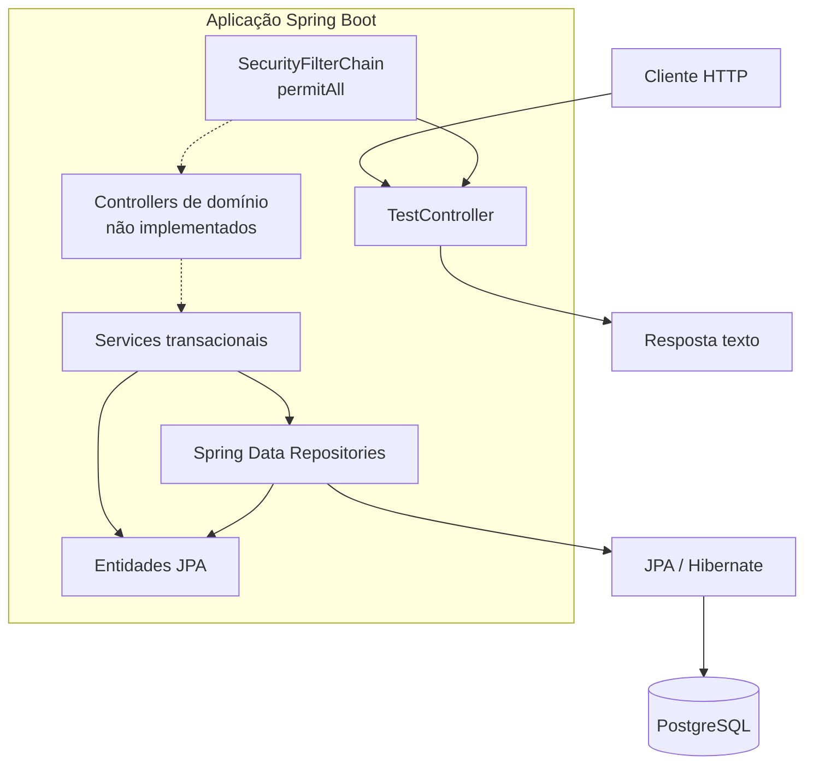
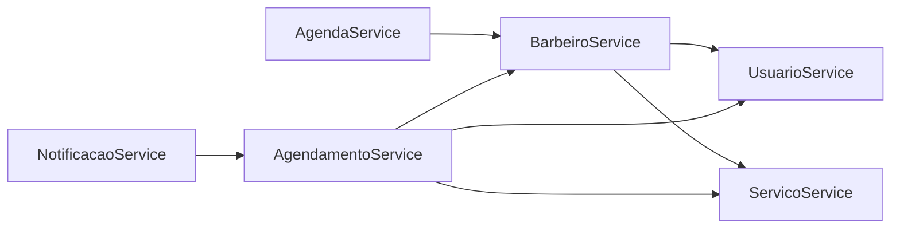

# Diagrama de arquitetura

[← Índice](../README.md) · [Descrição](../01-overview/architecture.md)

Linhas sólidas representam fluxo existente; a linha pontilhada representa a conexão planejada, ainda ausente, entre HTTP e domínio.

Dependências service-to-service relevantes:

