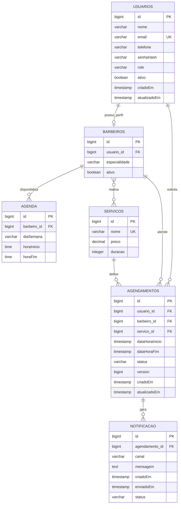

# Diagrama do banco de dados

[← Índice](../README.md) · [Modelo físico](../04-database/database-model.md)

Este ER representa os mapeamentos JPA. O schema físico real não foi fornecido.

Observação: camelCase acima acompanha atributos para legibilidade; nomes físicos de colunas implícitas dependem da naming strategy. `barbeiro_servico` é a join table N:N e foi omitida como entidade associativa porque não possui classe própria.
