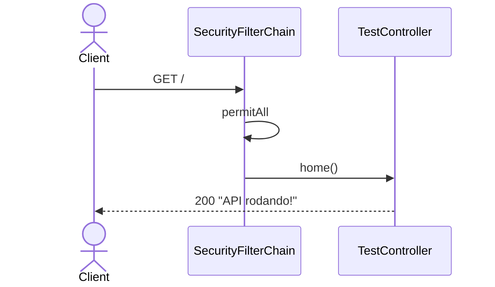
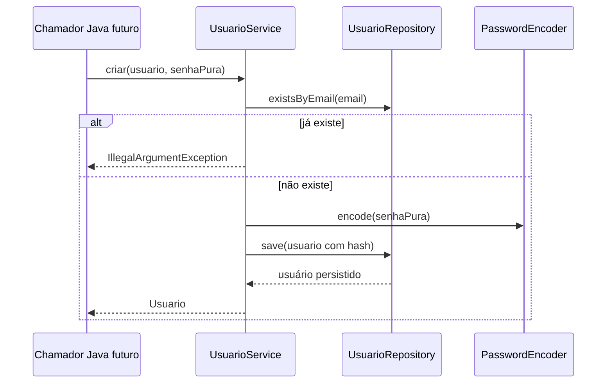
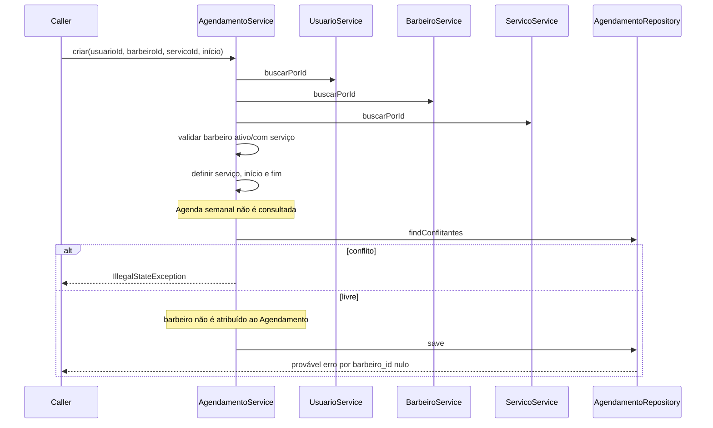
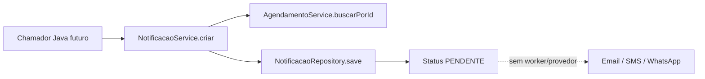

# Fluxos principais

[← Índice](../README.md) · [Regras](../02-domain/business-rules.md)

## Requisição HTTP real

## Criação interna de usuário

## Criação interna de agendamento — comportamento atual

## Notificação — registro, não entrega

Não existe fluxo real de autenticação, confirmação de agendamento ou envio externo; diagramá-los como existentes seria inventar funcionalidade.
